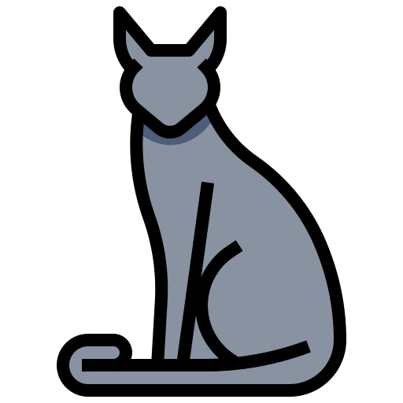
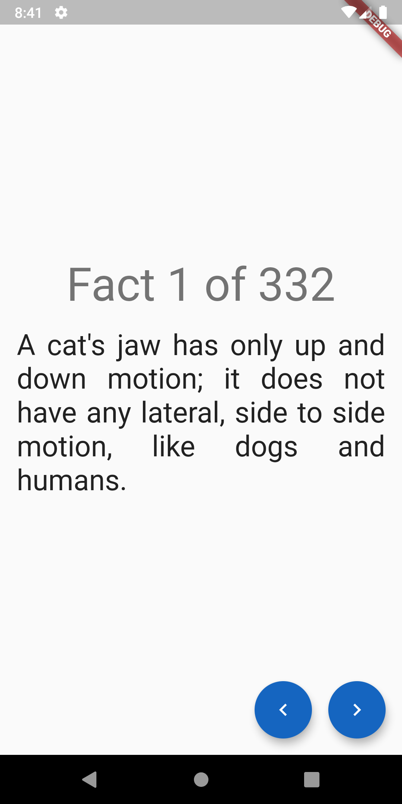

  
  
  
   
   
  
  
  
  
  
  

<h1 align="center">
feline-facts
</h1>

Feline Facts is a simple Flutter app that shows facts about cats. This project is my first Flutter application. It pulls data from the [cat facts API](https://catfact.ninja) and displays each fact one by one in a simple way. It was constructed while following [this](https://www.youtube.com/watch?v=KjE2IDphA_U&list=PLB6lc7nQ1n4iYGE_khpXRdJkJEp9WOech) tutorial by ResoCoder.

This app attemps to use clean architecture and the `BLoC` pattern with local caching of API data using an SQLite database. Note that this app has only been tested on Android.

## Screenshots

| |
|:---:|
||

## Technology Used

`Feline Facts` depends on open source software:

* Flutter SDK
* [get_it](https://pub.dev/packages/get_it)
* [sqflite](https://pub.dev/packages/sqflite)
* [flutter_bloc](https://pub.dev/packages/flutter_bloc)
* [equatable](https://pub.dev/packages/equatable)
* [dartz](https://pub.dev/packages/dartz)
* [data_connection_checker](https://pub.dev/packages/data_connection_checker)
* [http](https://pub.dev/packages/http)
* [flutter_launcher_icons](https://pub.dev/packages/flutter_launcher_icons)

## License

The project is licensed under the Apache License Version 2.0. See [LICENSE](LICENSE) for more details.

## Author

| [ @DeveloperPaul123](https://github.com/DeveloperPaul123) |
|:----:|

## Credits

Cat icon made by [surang](https://www.flaticon.com/authors/surang) from <a href="https://www.flaticon.com/" title="Flaticon"> www.flaticon.com</a>
